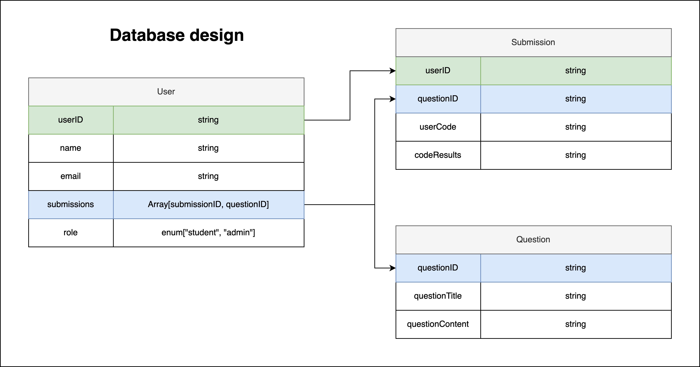

### Database design

### User endpoints

---

`/user/signUP`

**Description:** Registers a new user. By default, a user will be a student.

-   Protected: No
-   Permissions: Anyone

---

`/user/login`

**Description:** Logs a user in.

-   Protected: No
-   Permissions: Anyone

---

`/user/logout`

**Description:** Logs out a user.

-   Protected: No
-   Permissions: Anyone

---

`/user/getLoggedInUser`

**Description:** Gets info about the current logged in user.

-   Protected: Yes
-   Permissions: Anyone

---

`/user/delete/:userID`

**Description:** Deletes an existing user.

-   Protected: Yes
-   Permissions: Admin

---

`/user/getAllUsers`

**Description:** Gets a list of all registered users.

-   Protected: Yes
-   Permissions: Admin

### Submission endpoints

---

`/submission/runCode`

**Description:** Runs the provided code.

-   Protected: Yes
-   Permissions: Student, Admin

---

`/submission/submitCode/:userID/:questionID`

**Description:** Submits the code for evaluation.

-   Protected: Yes
-   Permissions: Student, Admin

---

`/submission/getSubmissions/:questionID`

**Description:** Gets all submissions for a particular question.

-   Protected: Yes
-   Permissions: Student, Admin

---

`/submission/getOneSubmission/:userID/:questionID`

**Description:** Gets a single submission for a user and question.

-   Protected: Yes
-   Permissions: Student, Admin

---

`/submission/deleteOneSubmission:/userID/:questionID`

**Description:** Deletes a single submission for a user and question.

-   Protected: Yes
-   Permissions: Student, Admin

### Question endpoints

---

`/question/getQuestion/:questionID`

**Description:** Gets a single question by ID.

-   Protected: Yes
-   Permissions: Student, Admin

---

`/question/allQuestions`

**Description:** Gets all questions.

-   Protected: Yes
-   Permissions: Student, Admin

---

`/question/createQuestion`

**Description:** Creates a new question.

-   Protected: Yes
-   Permissions: Admin

---

`/question/updateQuestion/:questionID`

**Description:** Updates an existing question.

-   Protected: Yes
-   Permissions: Admin

---

`/question/deleteQuestion/:questionID`

**Description:** Deletes an existing question.

-   Protected: Yes
-   Permissions: Admin
